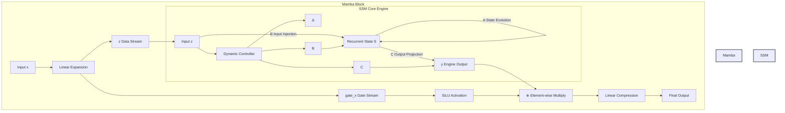

```mermaid
graph TD
    subgraph Mamba Block
        direction LR
        
        Input_x[Input x] --> Linear_Expand[Linear Expansion]
        Linear_Expand --> Stream_z[z Data Stream]
        Linear_Expand --> Stream_gate[gate_x Gate Stream]
        
        subgraph SSM Core Engine
            direction TB
            
            Node_z_input[Input z]
            Dynamic_Controller[Dynamic Controller]
            Param_Delta[Δ]
            Param_B[B]
            Param_C[C]
            State_Loop(Recurrent State S)
            Output_y[y Engine Output]

            Node_z_input --> Dynamic_Controller;
            Dynamic_Controller --> Param_Delta;
            Dynamic_Controller --> Param_B;
            Dynamic_Controller --> Param_C;
            
            State_Loop -- A State Evolution --> State_Loop;
            Node_z_input -- B Input Injection --> State_Loop;
            Param_B --> State_Loop;
            
            State_Loop -- C Output Projection --> Output_y;
            Param_C --> Output_y;
        end
        
        Stream_z --> Node_z_input;
        
        Stream_gate --> SiLU[SiLU Activation];
        Output_y --> Multiply[⊗ Element-wise Multiply];
        SiLU --> Multiply;
        
        Multiply --> Linear_Compress[Linear Compression];
        Linear_Compress --> Final_Output[Final Output];
    end

    style Mamba Block fill:#f9f,stroke:#333,stroke-width:2px;
    style SSM Core Engine fill:#bdf,stroke:#333,stroke-width:2px;
```