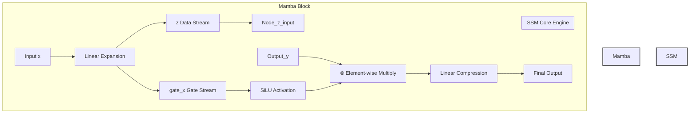

```mermaid
graph TD
    subgraph Mamba Block
        direction LR
        
        %% --- Step 1: Input Expansion & Gating ---
        Input_x[Input x] --> Linear_Expand[Linear Expansion]
        Linear_Expand --> Stream_z[z Data Stream]
        Linear_Expand --> Stream_gate[gate_x Gate Stream]
        
        %% --- Step 2: SSM Core Engine ---
        subgraph SSM Core Engine
            direction TB
            
            
        end
        
        %% --- Connecting the main stream to the subgraph ---
        Stream_z --> Node_z_input;
        
        %% --- Step 3: Final Gating & Output ---
        Stream_gate --> SiLU[SiLU Activation];
        Output_y --> Multiply[⊗ Element-wise Multiply];
        SiLU --> Multiply;
        
        Multiply --> Linear_Compress[Linear Compression];
        Linear_Compress --> Final_Output[Final Output];
    end

    %% --- Styling ---
    style Mamba Block fill:#f9f,stroke:#333,stroke-width:2px
    style SSM Core Engine fill:#bdf,stroke:#333,stroke-width:2px
```