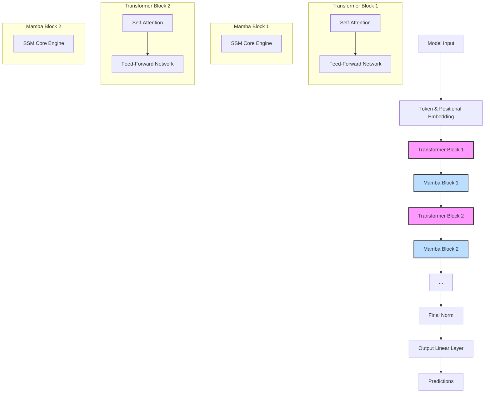

```mermaid
graph TD
    Input[Model Input] --> Embedding[Token & Positional Embedding];
    Embedding --> TBlock1[Transformer Block 1];
    TBlock1 --> MBlock1[Mamba Block 1];
    MBlock1 --> TBlock2[Transformer Block 2];
    TBlock2 --> MBlock2[Mamba Block 2];
    MBlock2 --> Etc[...]
    Etc --> FinalNorm[Final Norm];
    FinalNorm --> OutputLayer[Output Linear Layer];
    OutputLayer --> Predictions;

    subgraph Transformer Block 1
        direction TB
        Attn1[Self-Attention]
        FFN1[Feed-Forward Network]
        Attn1 --> FFN1
    end

    subgraph Mamba Block 1
        direction TB
        SSM1[SSM Core Engine]
    end

    subgraph Transformer Block 2
        direction TB
        Attn2[Self-Attention]
        FFN2[Feed-Forward Network]
        Attn2 --> FFN2
    end
    
    subgraph Mamba Block 2
        direction TB
        SSM2[SSM Core Engine]
    end

    style TBlock1 fill:#f9f,stroke:#333,stroke-width:2px
    style TBlock2 fill:#f9f,stroke:#333,stroke-width:2px
    style MBlock1 fill:#bdf,stroke:#333,stroke-width:2px
    style MBlock2 fill:#bdf,stroke:#333,stroke-width:2px
```