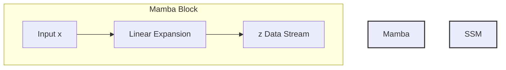

```mermaid
graph TD
    subgraph Mamba Block
        direction LR
        
        %% --- Step 1: Input Expansion & Gating ---
        Input_x[Input x] --> Linear_Expand[Linear Expansion]
        Linear_Expand --> Stream_z[z Data Stream]
        
    end

    %% --- Styling ---
    style Mamba Block fill:#f9f,stroke:#333,stroke-width:2px
    style SSM Core Engine fill:#bdf,stroke:#333,stroke-width:2px
```